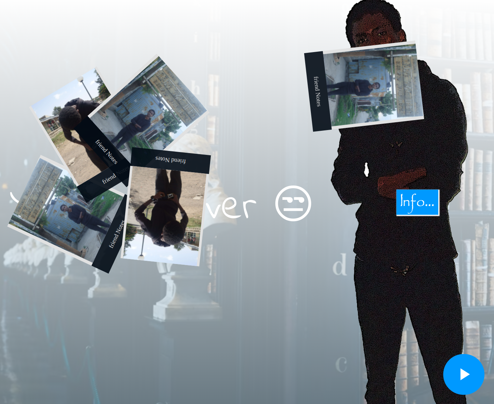

## Year website

This is a website for the BDU STEM center class of 2012. It is like a year book but online. More like a year website.
This website is where we document our class experiences through the last 4 years. It presentes different pictures albums using cool animations.

This project is built with vanilla js with the help of gsap liberary for the animations.

## Demo link:
Here is a demo hosted on [github](https://hileamlakb.github.io/STEM2012YearBook/)

## Screenshots

`

## Technologies
`html`, 
`css`, 
`Javascript`,
`gsap` 
